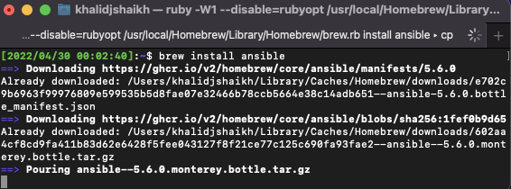
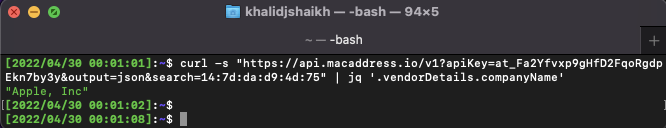
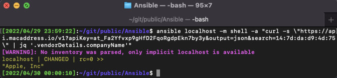

# Ansible

### Install ansible on macOS
```
brew install ansible
```

### On localhost
```
curl -s "https://api.macaddress.io/v1?apiKey=at_Fa2Yfvxp9gHfD2FqoRgdpEkn7by3y&output=json&search=14:7d:da:d9:4d:75" | jq '.vendorDetails.companyName'
```

### With Ansible
```
ansible localhost -m shell -a "curl -s \"https://api.macaddress.io/v1?apiKey=at_Fa2Yfvxp9gHfD2FqoRgdpEkn7by3y&output=json&search=14:7d:da:d9:4d:75\" | jq '.vendorDetails.companyName'" 
```


```
MAC="14:7d:da:d9:4d:75"; ansible localhost -m shell -a "curl -s \"https://api.macaddress.io/v1?apiKey=at_Fa2Yfvxp9gHfD2FqoRgdpEkn7by3y&output=json&search=$MAC\" | jq '.vendorDetails.companyName'" 
```

```
ansible localhost -m shell -a "curl -s \"https://api.macaddress.io/v1?apiKey=at_Fa2Yfvxp9gHfD2FqoRgdpEkn7by3y&output=json&search={{MAC}}\" | jq '.vendorDetails.companyName'"  --extra-vars "MAC=14:7d:da:d9:4d:75"
```